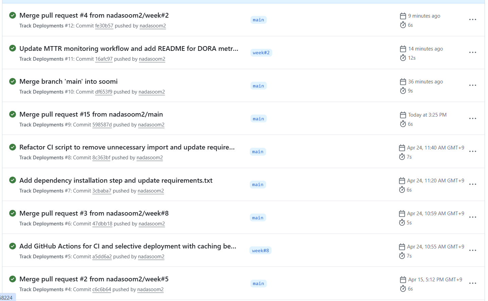
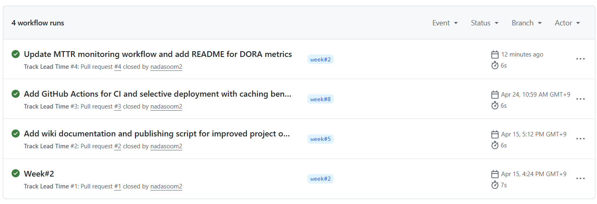
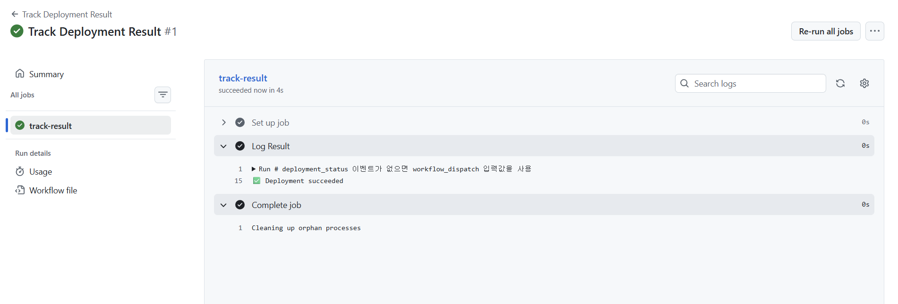
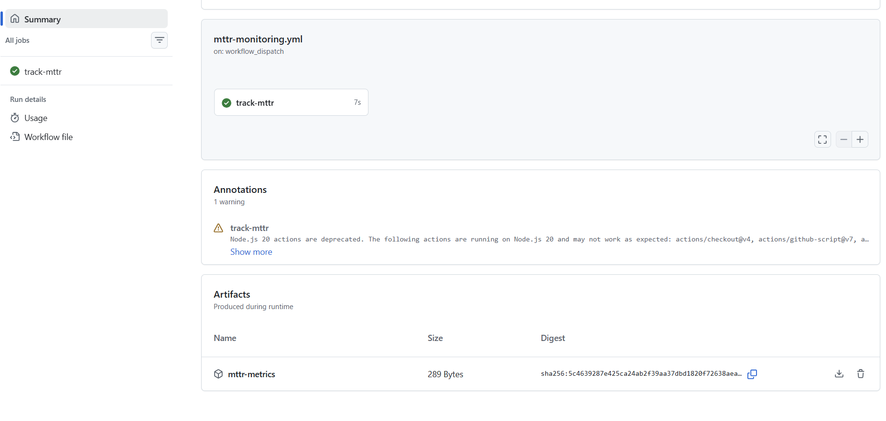

# DORA 지표 결과

이 문서는 DORA 지표 결과 이미지를 넣기 위한 자리표시자 구조입니다.
아래 이미지 경로를 생성한 차트나 스크린샷 경로로 바꿔서 사용하세요.

## 개요

- 프로젝트: `yhs`
- 보고 날짜: `2026-04-29`
- 대상 워크플로: `workflows/`

## 요약

현재 전달 성과에 대한 간단한 요약을 작성하세요.

| Metric | 값 | 파일 위치 | 설명 |
| --- | --- | --- | --- |
| Deployment Frequency | `높음 (최근 지속 실행)` | [.github/workflows/deployment.yml](.github/workflows/deployment.yml) | 최근 Track Deployments 실행 이력이 연속적으로 관찰되고 모두 성공 상태여서, 배포가 끊기지 않고 자주 수행되는 편으로 해석할 수 있습니다. 실행 소요 시간도 대체로 짧아(약 5~12초) 배포 추적 파이프라인은 안정적으로 동작 중입니다. |
| Lead Time for Changes | `안정적 (최근 4회 연속 성공)` | [.github/workflows/lead-time.yml](.github/workflows/lead-time.yml), `metrics.yml` | 최근 PR이 닫힐 때마다 워크플로가 실행되었고 4회 모두 성공했습니다. 실행 시간도 약 6~7초로 짧아서, 변경 후 리드 타임을 기록하는 파이프라인이 안정적으로 동작하고 있다고 볼 수 있습니다. |
| Change Failure Rate | `수동 실행 성공` | [.github/workflows/change_failure_rate.yml](.github/workflows/change_failure_rate.yml) | `Track Deployment Result`를 수동 실행했을 때 `Deployment succeeded` 로그가 정상 출력되어, 배포 결과를 성공으로 기록하는 흐름은 정상입니다. 현재 화면만 보면 실패 사례는 없어서 실제 실패율 수치보다는 성공 추적 상태를 확인한 결과로 해석할 수 있습니다. |
| Mean Time to Restore | `실행 성공 (약 7초)` | [.github/workflows/mttr-monitoring.yml](.github/workflows/mttr-monitoring.yml), `mttr-metrics.json` | `Generate MTTR metrics`와 `Upload MTTR metrics` 단계가 정상 완료되어 지표 파일 생성/업로드 흐름은 정상입니다. 다만 실행 경고 1건이 있어 사용 액션 런타임(예: Node.js 버전) 호환성 점검이 필요합니다. |

## DORA 차트

### Deployment Frequency

![Deployment Frequency] 

### Lead Time for Changes

![Lead Time for Changes] 

### Change Failure Rate

![Change Failure Rate] 

### Mean Time to Restore!

![Mean Time to Restore] 

