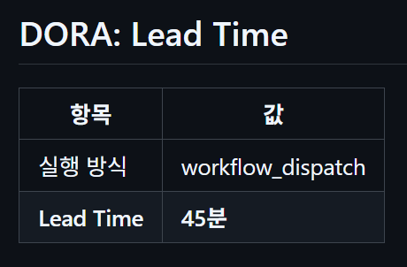
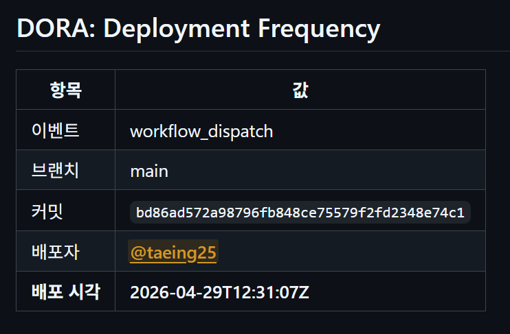
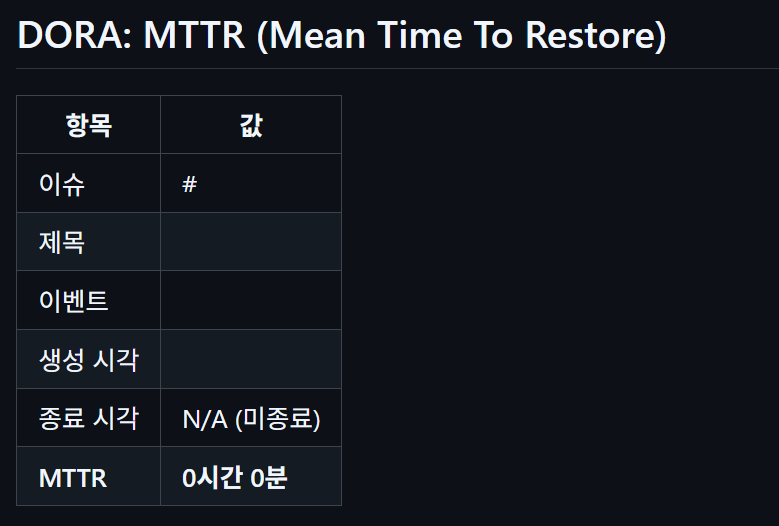
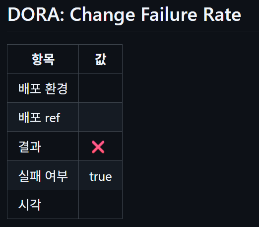

# DORA 메트릭 수집 자동화

GitHub Actions 워크플로우를 통해 DORA 4대 지표를 자동 수집합니다.

## DORA 지표 수집 결과

| 지표 | 워크플로우 | 트리거 | 결과 |
|---|---|---|---|
| Lead Time | `lead-time.yml` | PR 병합 시 | 45분 |
| Deployment Frequency | `deployment.yml` | main push 시 | 2026-04-29 기록 |
| MTTR | `mttr-monitoring.yml` | 이슈 open/close 시 | 이슈 기반 추적 중 |
| Change Failure Rate | `change_failure_rate.yml` | deployment_status | 배포 환경 연동 시 측정 |

---

## 워크플로우 설명

### 1. Lead Time (`lead-time.yml`)

PR이 생성된 시점부터 main에 병합될 때까지 걸린 시간을 측정합니다.

- **트리거**: PR 병합 (`pull_request: types: [closed]`) / 수동 실행 (`workflow_dispatch`)
- **출력**: Lead Time (초/분), JSON 아티팩트, Job Summary 표
- **수동 실행 시**: 시뮬레이션 Lead Time 값(분) 입력 가능

### 2. Deployment Frequency (`deployment.yml`)

배포 이벤트를 추적하여 배포 빈도를 기록합니다.

- **트리거**: main 브랜치 push / `workflow_dispatch` / deployment 이벤트
- **출력**: 배포 시각, 브랜치, 커밋, 배포자 정보, JSON 아티팩트

### 3. MTTR (`mttr-monitoring.yml`)

이슈가 열린 시점부터 닫힐 때까지 걸린 시간을 측정합니다.

- **트리거**: 이슈 open/close/label 변경 / `workflow_dispatch`
- **출력**: MTTR (시간/분), JSON 아티팩트, Job Summary 표

### 4. Change Failure Rate (`change_failure_rate.yml`)

배포 성공/실패 비율을 추적합니다.

- **트리거**: `deployment_status` 이벤트 / `workflow_dispatch`
- **출력**: 배포 결과(성공/실패), JSON 아티팩트, Job Summary 표

---

## 아티팩트

각 워크플로우 실행 후 JSON 아티팩트가 자동 저장됩니다 (보관 기간: 30일).

Actions 탭 → 해당 실행 → Artifacts 에서 확인 가능합니다.

---

## 실행 결과 화면

### Lead Time

### Deployment Frequency

### MTTR

### Change Failure Rate

---

> 📝 이 문서는 작성 과정에서 생성형 AI(Claude)의 도움을 받아 작성되었습니다.
