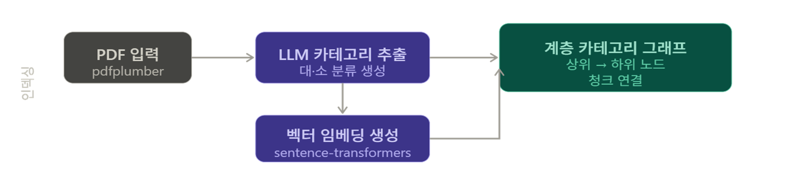
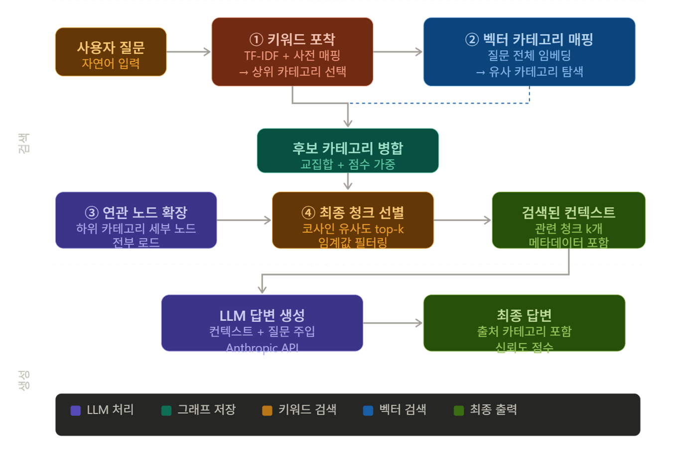

# Neo4j PDF Indexing (저장 전용)

이 프로젝트는 PDF 문서를 계층 카테고리 그래프로 변환하여 Neo4j에 저장합니다.
질의/답변은 포함하지 않고, DB 저장 파이프라인만 실행합니다.



## 1) 폴더 구조

- `hierarchical_rag.py`: 실행 엔트리포인트
- `indexing/config.py`: .env 로딩, 설정값, 환경 검증
- `indexing/parser.py`: PDF 텍스트 추출/청킹
- `indexing/categorizer.py`: Gemini 기반 카테고리 생성 + 폴백
- `indexing/embedder.py`: SentenceTransformer 임베딩 + 폴백
- `indexing/store.py`: Neo4j 저장(MERGE)
- `indexing/indexer.py`: 단일 PDF 인덱싱 오케스트레이션
- `indexing/pipeline.py`: 폴더 단위 일괄 인덱싱

## 2) 필수 설치

PowerShell에서 실행:

```powershell
python -m pip install neo4j google-generativeai pdfplumber numpy scikit-learn sentence-transformers==3.0.1
python -m pip install --upgrade torch==2.6.0 --index-url https://download.pytorch.org/whl/cpu
```

## 3) .env 설정

프로젝트 루트에 `.env` 파일:

```env
GEMINI_API_KEY=YOUR_GEMINI_API_KEY
GEMINI_MODEL=gemini-3.0-flash

NEO4J_URI=bolt://localhost:7687
NEO4J_USER=neo4j
NEO4J_PASSWORD=YOUR_NEO4J_PASSWORD

PDF_DIR=C:\Users\<USER>\neo4j\pdf

# Indexing tuning
CHUNK_SIZE=380
CHUNK_OVERLAP=76
SIM_THRESHOLD=0.27
```

## 4) 실행 방법

```powershell
python hierarchical_rag.py
```

실행 동작:

1. `PDF_DIR`의 `*.pdf` 스캔
2. `doc_key` 기준으로 이미 저장된 파일은 스킵
3. 신규 파일만 Document/Category/Chunk 및 관계 저장

## 5) 저장 스키마 요약

- `(:Document {doc_key, file_path, indexed_at})`
- `(:Category {node_id, name, level, keywords_json, embedding_json, doc_key})`
- `(:Chunk {chunk_id, text, page, embedding_json, doc_key})`
- `(:Document)-[:HAS_CATEGORY]->(:Category {level:0})`
- `(:Category)-[:HAS_SUBCATEGORY]->(:Category {level:1})`
- `(:Chunk)-[:BELONGS_TO]->(:Category {level:1})`

## 6) 자주 발생하는 이슈

### A. torch DLL 오류(WinError 1114/126)

```powershell
python -m pip uninstall -y torch torchvision torchaudio
python -m pip install --upgrade torch==2.6.0 --index-url https://download.pytorch.org/whl/cpu
```

### B. SentenceTransformer 초기화 실패(보안 정책)

- 원인: torch 2.6 미만
- 해결: torch를 `2.6.0+cpu` 이상으로 업그레이드

### C. huggingface symlink 경고

- 기능 문제는 아님(캐시 효율 경고)
- 필요 시 Windows 개발자 모드 활성화 또는 아래 환경변수 사용:

```powershell
$env:HF_HUB_DISABLE_SYMLINKS_WARNING="1"
```

## 7) 결과 검증 Cypher

```cypher
MATCH (ch:Chunk)-[:BELONGS_TO]->(c:Category)
WHERE c.level = 1
RETURN c.name AS subcategory, count(ch) AS chunks
ORDER BY chunks DESC;
```

```cypher
MATCH (ch:Chunk)
WHERE NOT (ch)-[:BELONGS_TO]->(:Category)
RETURN count(ch) AS orphan_chunks;
```

`orphan_chunks = 0`이면 연결 무결성은 정상입니다.


